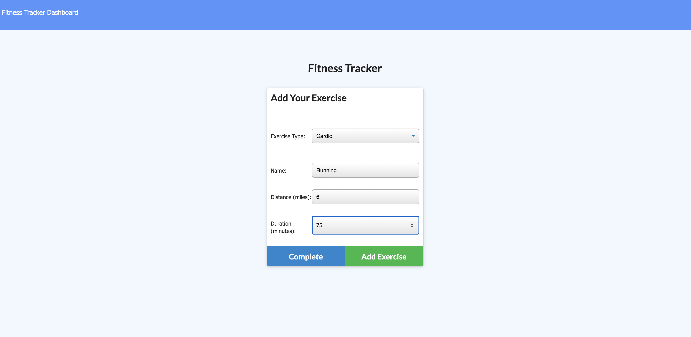
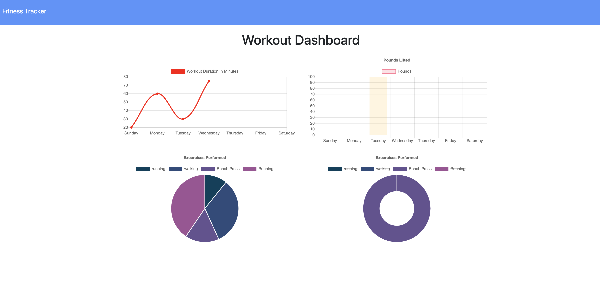

# Nosql Workout Tracker

## Description 

Create a workout/fitness tracker using Mongo database and mongoose schema. The app is deployed on Heroku using the Atlas db.
                

## Table of Contents
                                           
* [Installation](#installation)
* [User Story](#userstory)
* [License](#license)

* [Questions](#questions)
                    
## Installation
                      
npm start if running locally
                     
## User Story

* As a user, I want to be able to view create and track daily workouts. I want to be able to log multiple exercises in a workout on a given day. I should also be able to track the name, type, weight, sets, reps, and duration of exercise. If the exercise is a cardio exercise, I should be able to track my distance traveled.
                    
## License
                      
Project license: MIT
                                                        
## Questions
Let me know if you have any questions! Check out my [GitHub Profile](https://github.com/davidnjaffe)                 
Or email me @ <davidnjaffe@gmail.com>
                      
